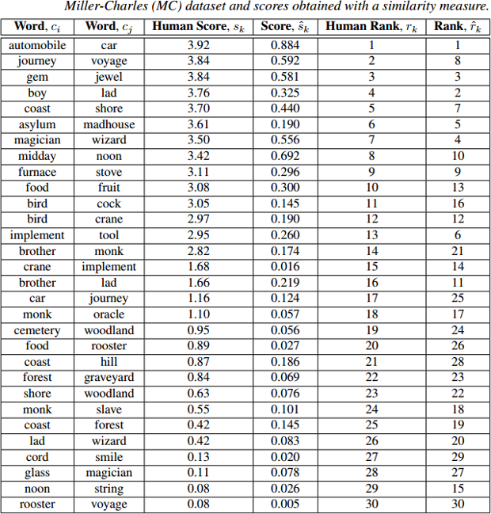
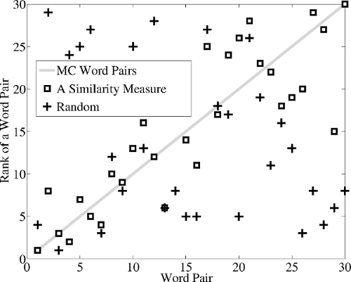
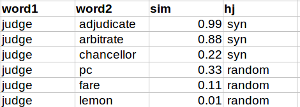

# Task Description

There are two fairly similar tasks: the relatedness task and the association task. Each shared task is described below. Each task has two independent evaluation datasets.

## 1\. The Relatedness Task

The goal of this task is to find semantically related words. Words are considered to be related if they are synonyms, hypernyms or hyponyms. For instance:

* авиация, авиа, syn
* абориген, индеец, hypo
* бизнесмен, владелец, hyper

You can find definitions of these semantic relation types here: [http://en.wiktionary.org/wiki/Wiktionary:Semantic_relations](http://en.wiktionary.org/wiki/Wiktionary:Semantic_relations).

Quality of a semantic similarity measure in this task will be assessed based on two criteria. The first benchmark is based on human judgments about semantic similarity (a translated version of the widely used MC, RG, and WordSim353 datasets). The second benchmark follows the structure of the [BLESS dataset](https://github.com/alexanderpanchenko/sim-eval/blob/master/datasets/bless.csv) (see also [Baroni and Lenchi (2011)](http://www.aclweb.org/anthology/W11-2501)). This benchmark is derived from the [RuThes Lite](http://www.labinform.ru/pub/ruthes/index.htm) thesaurus. More details about each benchmark are provided below.

### 1.1 Evaluation based on Correlation with Human Judgments

This benchmark quantifies how well a system predicts a similarity score of a word pair. This is the most common way to assess a semantic similarity measure and is used by many researchers.

**Input (what we provide you)**: a list of word pairs in an UTF-8 encoded CSV file in the following format:

    word1,word2\n

**Output (what you provide us)**: similarity score between each pair in the range [0;1] in an UTF-8 encoded CSV file in the following format:

    word1,word2,sim\n

**Evaluation metric**: [Spearman’s rank correlation](http://en.wikipedia.org/wiki/Spearman's_rank_correlation_coefficient) coefficient (rho) between a vector of human judgments "Human Score" and your similarity scores "sim" (denoted as "Score" on the figure below). The following figure shows you an example of such an evaluation dataset. This is the [Miller-Charles dataset](http://www.cs.cmu.edu/%7Emfaruqui/suite.html).

Figure below presents a visualization of Spearman's rank correlation of human judgements and similarity scores. In this case, Spearman's rank correlation of a similarity measure on this benchmark is 0.843 (p<0.001), whereas correlation of a random measure is 0.173 (p=0.360).

You can download a [sample from the testing dataset](hj-sample.csv) composed of 66 pairs (see also the table below). Please keep in mind that this is not a training dataset. The goal is just to show you the format of the test data.

    word1        word2          sim
    петух        петушок        0.952381
    побережье    берег          0.904762
    тип          вид            0.851852
    миля         километр       0.791667
    чашка        посуда         0.761905
    птица        петух          0.714286
    война        войска         0.666667
    улица        квартал        0.666667
    . . .
    доброволец   девиз          0.090909
    аккорд       улыбка         0.087719
    энергия      кризис         0.083333
    бедствие     площадь        0.047619
    производство экипаж         0.047619
    мальчик      мудрец         0.041667
    прибыль      предупреждение 0.041667
    напиток      машина         0
    сахар        подход         0
    лес          погост         0
    практика     учреждение     0

### 1.2 Evaluation based on Semantic Relation Classification

This benchmark quantifies how well a system can distinguish related word pairs from unrelated ones.

**Input (what we provide you)**: a list of word pairs in an UTF-8 encoded CSV file in the following format:

    word1,word2\n

**Output (what you provide us)**: similarity score between each pair in the range [0;1] in an UTF-8 encoded CSV file in the following format:

    word1,word2,sim\n

**Evaluation metric:** [Average Precision](http://en.wikipedia.org/wiki/Information_retrieval#Average_precision) (area under the [Precision-Recall curve](http://nlp.stanford.edu/IR-book/html/htmledition/evaluation-of-ranked-retrieval-results-1.html)). Additionally we will calculate [Accuracy](http://en.wikipedia.org/wiki/Accuracy_and_precision) and AUC under the ROC curve, but the official metric will be the Average Precision.

In this benchmark, similarity scores are used to distinguish semantically related pairs of words from semantically unrelated pairs. Each word in the test collection has 50% of related and 50% of unrelated terms. For instance:

As each word has precisely half related and half unrelated words, one can classify pairs given the scores as following:

1.  Sort the table by “word1” and “sim”.
2.  Set to 1 the “related” label of the first 50% relations of “word1”.
3.  Set to 0 the “related” label of the last 50% relations of “word1”.

For instance:

One the "related" column is calculated, it is straighforward to calculate Accuracy and AUC of a similarity measure.

### 1.3 Training Data

**Sample of human judgements about semantic similarity**: [hj-sample.csv](hj-sample.csv).

The judgemens were obtained via a crowdsourcing procedure. The judgemens are provided in an UTF-8 encoded CSV file in the following format:

    word1,word2,sim\n

Here _sim_ is semantic similarity of words. This is the mean score on the scale {0,1,2,3} over all human judgements. Annotation instruction can be found here: [annotate.txt](annotate.txt).

**Semantic relations between words**: [rt-train.csv](rt-train.csv).

These relations were sampled from the [RuThes Lite thesaurus](http://www.labinform.ru/pub/ruthes/index.htm). Therefore, you cannot use this thesaurus in this track. The relations are provided in an UTF-8 encoded CSV file in the following format:

    word1,word2,sim\n

Here _sim_ is the type of a relation. It can be one of the following:

* syn — synonyms
* hyper — hyperonyms
* hypo — hyponyms

**Negative training samples**: Please note that these training data contain no negative training samples. In order to obtain negative examples of a given word you can use relations of other words or another strategy. A limited number of negative training samples will only be available in the test set.

## 2\. The Association Task

In this task, two words are considered similar if the second is an association of the first one. Association here is understood as the "free association" of a person on an input word called "stimulus". We use results of two large-scale Russian associative experiments in order to build training and test collections: [Russian Associative Thesaurus](http://it-claim.ru/Projects/ASIS/) (an offline experiment) and [Sociation.org](http://sociation.org/) (an online experiment).

The goal of this task is to find cognitive associations of an input word. In an associative experiment respondents are asked to provide an association to an input word. This is normally the first thing that comes to mind of a person, e.g.:

* время, деньги, 14
* россия, страна, 23
* рыба, жареная, 35
* женщина, мужчина, 71
* песня, веселая, 33

The association task is based on the Russian associative experiment data. Therefore, type of a semantic relation here is not constrained. A relation can be of any type: synonyms, hyponyms, homonyms, etc.

Quality of a similarity measure in this task will be assessed via "Evaluation based on Semantic Relation Classification" similarly to the relatedness task (see the Section 1.2 for more details). Therefore, you will be given pairs of words. In other words, you are not asked to generate a set of associations for an input word in this task. You are rather asked to calculate similarities between word pairs as in all other tasks of RUSSE.

### 2.2 Training Data

**Associations between words**: [ae-train.csv](ae-train.csv)

These relations were sampled from the [Russian Associative Thesaurus](http://it-claim.ru/Projects/ASIS/) . Therefore, you cannot use this thesaurus in this track. The relations are provided in an UTF-8 encoded CSV file in the following format:

    word1,word2,sim\n

Here _sim_ is the number of responses. For instance, the line "время,деньги,14" means that 14 people provided the reaction "деньги" on the stimulus "время".

**Associations between words**: [ae2-train.csv](ae2-train.csv)

These relations were sampled from the [Sociation.org](http://sociation.org/) database. Therefore, you cannot use this resource in this track. The relations are provided in an UTF-8 encoded CSV file in the following format:

    word1,word2,sim,dir,rev\n

Here _dir_ and _rev_ is the number of direct (_word1 -> word2_) and reverse (_word2 -> word1_) responses. The _sim_ column contains similarity of words calculated as following: _sim = (dir + rev)/2 * (min(dir+2, rev+2)/max(dir+2, rev+2))_ .

**Negative training samples**: Please note that the training data contain no negative training samples. In order to obtain negative examples of a given word you can use relations of other words or another strategy. A limited number of negative training samples will only be available in the test set.

**Please, note that there will be two separate evaluations in the associatin task: one for the Russian Associative Thesaurus and another for the Sociation.org data.**

## 3\. Submission Format

You will be provided with a list of word pairs in the format

    word1,word2\n

We are going to provide about 15,000 word pairs for testing. You should quickly (during several days) calculate semantic similarity scores between them. Each score should be in the range [0;1]. You should send the results to us in the format

    word1,word2,sim

All aforementioned performance metrics for both relatedness and association tasks (spearman correlation, accuracy, auc) are calculated based on this input. You are allowed to submit up to three different results per task.

You are allowed to use any tool and resource in order to build a semantic similarity measure except for the RuThes Lite thesaurus and the Russian Associative Thesaurus. Some data you can start from are listed below.

## 5\. Additional Resources

We collected here pointers to some additional resources that you may find useful for building your semantic similarity measure.

* **Russian Wikipedia**. This corpus is a common choice for training semantic similarity systems.
  * [Text version](https://s3-eu-west-1.amazonaws.com/dsl-research/wiki/wiki-ru-noxml.txt.bz2) of the Wikipedia cleaned from Wiki markup (UTF-8).
  * [POS tagged version](https://s3-eu-west-1.amazonaws.com/dsl-research/wiki/wiki-ru-pos.csv.bz2) of the Wikipedia (UTF-8) in the following format: "surface lemma part-of-speech"
* **[Wikipedia co-occurrence scores](https://s3-eu-west-1.amazonaws.com/dsl-research/wiki/wiki-cooccur-ge2.csv.bz2).** The file is in the format “word1,word2,num”. Here “num” is the number of times “word1” and “word2” co-occurred within Wikipedia articles.
* **[RuWaC](http://corpus.leeds.ac.uk/tools/ru/ruwac-parsed.out.xz)**. A web-based corpus. An advantage of this corpus is that it is already syntactically parsed with MaltParser.

### Baseline systems

* [JWTKL](https://code.google.com/p/jwktl/)
* [Word2Vec](https://code.google.com/p/word2vec/)
* [SemanticVectors](https://code.google.com/p/semanticvectors/)
* [AirHead Reseach](https://code.google.com/p/airhead-research/) and [S-Space](https://github.com/fozziethebeat/S-Space)
* [GenSim](http://radimrehurek.com/gensim/index.html)
* [Serelex](http://serelex.cental.be/page/about). See the “API” section.
* [DISSECT](http://clic.cimec.unitn.it/composes/toolkit/)
* [UBY](https://www.ukp.tu-darmstadt.de/data/lexical-resources/uby/). UBY is available in English and German only, but it contains many translations into Russian from different sources.
* [GloVe](http://nlp.stanford.edu/projects/glove)
* [DependencyVectors (DV)](http://www.nlpado.de/~sebastian/software/dv.shtml)

### Useful tools

* [PyMystem3](https://pypi.python.org/pypi/pymystem3/0.1.1) — a Python wrapper around Yandex Mystem.
* [TreeTagger](https://nlpub.ru/TreeTagger) and [MaltParser](https://nlpub.ru/MaltParser) for Russian.
* [Lucene](http://lucene.apache.org/) text search library.
